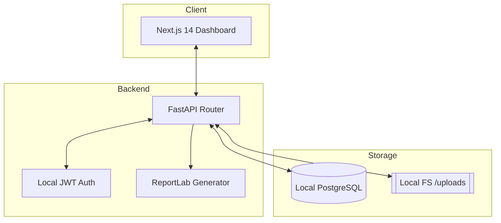

# Passerelle AI (V1)

Infrastructure opérationnelle pour les ONG aidant les migrants en France. 
**Local-first, Privacy-first, French-first.**


## 🎯 Qui est ce pour ?
Passerelle AI est conçu pour les associations, les ONG et les travailleurs sociaux qui accompagnent les usagers dans leurs démarches administratives et juridiques complexes.

## 🛡️ Pourquoi le "Local-First" ?
- **Confidentialité Totale**: Vos données ne quittent jamais votre machine.
- **Résilience**: Fonctionne sans internet.
- **Souveraineté**: Vous êtes le seul propriétaire de la base de données.

## 🏗️ Architecture du Système



## 🔐 Authentification Locale (V1.3)
Passerelle AI gère désormais les comptes utilisateurs par association.
- **Rôles** : Administrateur, Bénévole, Relecteur, Observateur.
- **Isolation** : Séparation stricte des données entre associations (Workspaces).
- **Login Démo** : `demo@passerelle.ai` / `demo123`

## 🤝 Flux NGO Standard
1. **Inscription** : L'administrateur crée l'espace de l'association.
2. **Équipe** : L'administrateur ajoute les bénévoles et relecteurs.
3. **Dossier** : Création d'un dossier usager et signature du consentement.
4. **Documents** : Importation sécurisée des documents.
5. **Revue** : Validation humaine des données extraites.
6. **Rapport** : Génération de la synthèse PDF.

## 🚀 Démarrage local en 3 commandes

Pour les fondateurs et administrateurs, lancez toute la plateforme en local en 3 étapes ultra-simples :

1. **Réinitialiser l'environnement et la base de données :**
   ```bash
   ./scripts/demo_reset.sh
   ```
2. **Lancer le diagnostic de santé système (Optionnel) :**
   ```bash
   ./scripts/doctor.sh
   ```
3. **Lancer toute la plateforme d'un coup (Frontend + Backend) :**
   ```bash
   ./scripts/start_local.sh
   ```

*Consultez notre [Guide d'utilisation Fondateur](./docs/founder-local-runbook.md) complet pour apprendre à tester l'OCR locale, l'extraction structurée déterministe et la gestion des comptes admin.*

## 📚 Documentation
- [Matrice des Rôles V1.3](./docs/v1-3-auth-plan.md)
- [Plan de Test Pilote](./docs/pilot-plan-fr.md)
- [Politique RGPD](./docs/gdpr.md)

### 🎤 Présentation aux associations (Pilote)
- [One-Pager (Résumé)](./docs/presentation/onepager-fr.md)
- [Diaporama de Présentation](./docs/presentation/slide-outline-fr.md)
- [Script de Démo (20 min)](./docs/presentation/demo-script-fr.md)
- [Checklist Avant Démo](./DEMO_FLOW_CHECKLIST_FR.md)
- [Modèles d'Emails de Prospection](./docs/presentation/email-outreach-fr.md)
- [Conditions de l'Offre Pilote](./docs/presentation/pilot-offer-fr.md)
- [Plan des Captures d'Écran](./docs/presentation/visual-assets-plan.md)

---
*Information à vérifier avec un professionnel qualifié. Zéro donnée cloud en V1.*
