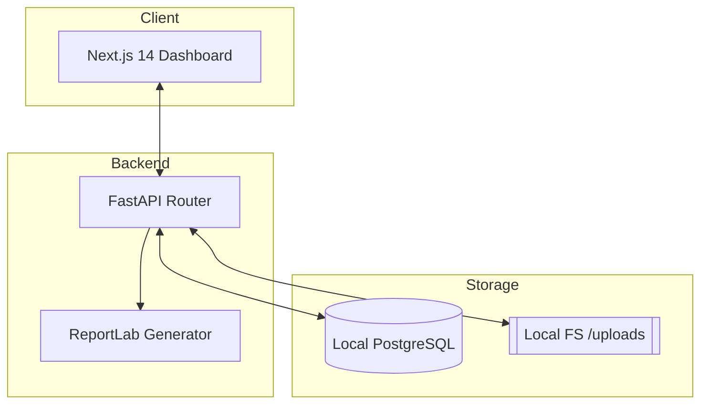
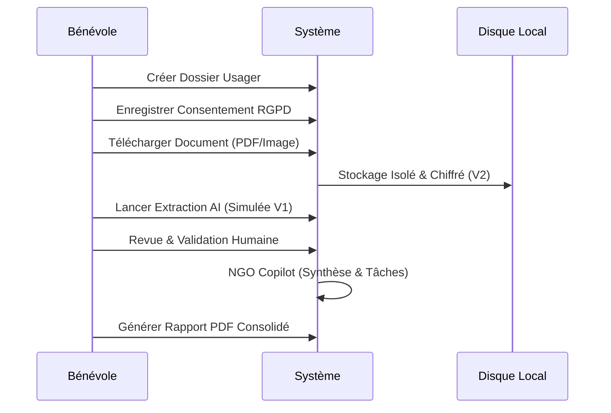

# Passerelle AI (V1)

Infrastructure opérationnelle pour les ONG aidant les migrants en France. 
**Local-first, Privacy-first, French-first.**


## 🎯 Qui est ce pour ?
Passerelle AI est conçu pour les associations, les ONG et les travailleurs sociaux qui accompagnent les usagers dans leurs démarches administratives et juridiques complexes. Notre priorité est de protéger les données sensibles tout en automatisant les tâches répétitives.

## 🛡️ Pourquoi le "Local-First" ?
La plupart des outils modernes envoient vos données dans le cloud. Pour une ONG traitant des données de migrants, cela pose des risques de sécurité et de souveraineté.
- **Confidentialité Totale**: Vos données ne quittent jamais votre machine.
- **Résilience**: Fonctionne sans internet.
- **Contrôle**: Vous êtes le seul propriétaire de la base de données.

## 🏗️ Architecture du Système



## 🔄 Workflow Opérationnel



## 🚀 Lancement Rapide (Demo)

### Initialisation
```bash
# Réinitialise la base et injecte les données de démo
./scripts/demo_reset.sh
```

### Démarrage
**Backend:**
```bash
cd backend && python main.py
```

**Frontend:**
```bash
cd frontend && npm run dev
```
*Accès : http://localhost:3000*

## 🤝 Pilot avec une association
Nous lançons une phase pilote de 2 semaines avec des associations partenaires pour valider l'outil en conditions réelles.
- **Kit de Pilotage** : [Consulter le plan de test](./docs/pilot-plan-fr.md)
- **Formulaire de Feedback** : [Partager vos retours](./FEEDBACK_FORM_FR.md)
- **Roadmap** : [Voir les prochaines étapes](./docs/v1-2-roadmap.md)

## 📚 Documentation
- [Release Notes V1](./RELEASE_NOTES_V1.md)
- [Script de Démo Français](./DEMO_SCRIPT_FR.md)
- [ NGO One-Pager](./docs/ngo-onepager-fr.md)
- [Stack Technique](./docs/technical-stack.md)
- [Politique de Confidentialité](./docs/gdpr.md)

---
*Information à vérifier avec un professionnel qualifié ou une association spécialisée. Zéro donnée cloud en V1.*
