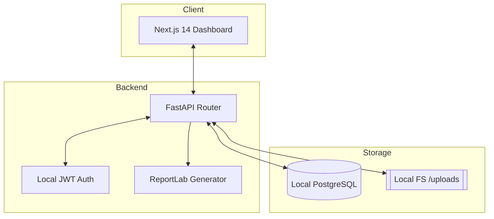

# Passerelle AI (V1)

Infrastructure opérationnelle pour les ONG aidant les migrants en France. 
**Local-first, Privacy-first, French-first.**


## 🎯 Qui est ce pour ?
Passerelle AI est conçu pour les associations, les ONG et les travailleurs sociaux qui accompagnent les usagers dans leurs démarches administratives et juridiques complexes.

## 🛡️ Pourquoi le "Local-First" ?
- **Confidentialité Totale**: Vos données ne quittent jamais votre machine.
- **Résilience**: Fonctionne sans internet.
- **Souveraineté**: Vous êtes le seul propriétaire de la base de données.

## 🏗️ Architecture du Système



## 🔐 Authentification Locale (V1.3)
Passerelle AI gère désormais les comptes utilisateurs par association.
- **Rôles** : Administrateur, Bénévole, Relecteur, Observateur.
- **Isolation** : Séparation stricte des données entre associations (Workspaces).
- **Login Démo** : `demo@passerelle.ai` / `demo123`

## 🤝 Flux NGO Standard
1. **Inscription** : L'administrateur crée l'espace de l'association.
2. **Équipe** : L'administrateur ajoute les bénévoles et relecteurs.
3. **Dossier** : Création d'un dossier usager et signature du consentement.
4. **Documents** : Importation sécurisée des documents.
5. **Revue** : Validation humaine des données extraites.
6. **Rapport** : Génération de la synthèse PDF.

## 🚀 Lancement Rapide (Demo)

### Initialisation
Assurez-vous que PostgreSQL est lancé, puis :
```bash
chmod +x scripts/demo_reset.sh
./scripts/demo_reset.sh
```

### Démarrage
**Backend:**
```bash
cd backend && python main.py
```

**Frontend:**
```bash
cd frontend && npm run dev
```

## 📚 Documentation
- [Matrice des Rôles V1.3](./docs/v1-3-auth-plan.md)
- [Plan de Test Pilote](./docs/pilot-plan-fr.md)
- [Politique RGPD](./docs/gdpr.md)

---
*Information à vérifier avec un professionnel qualifié. Zéro donnée cloud en V1.*
